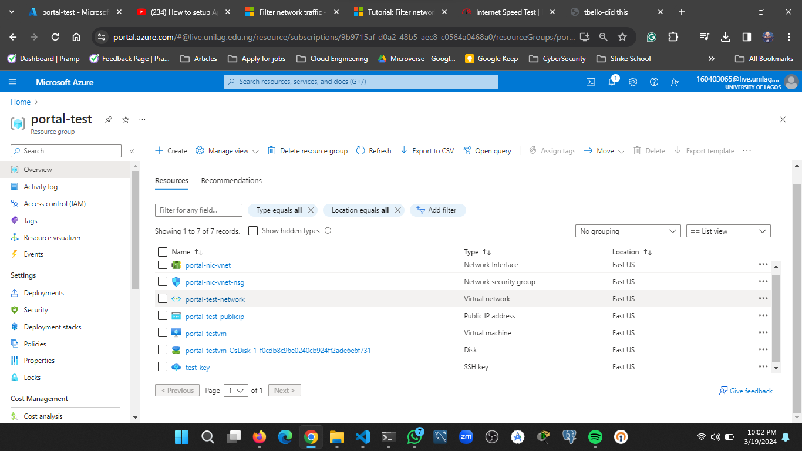
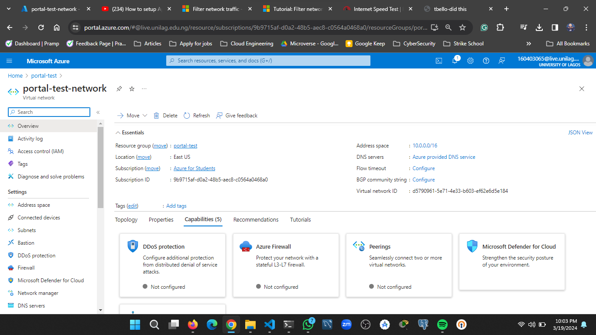
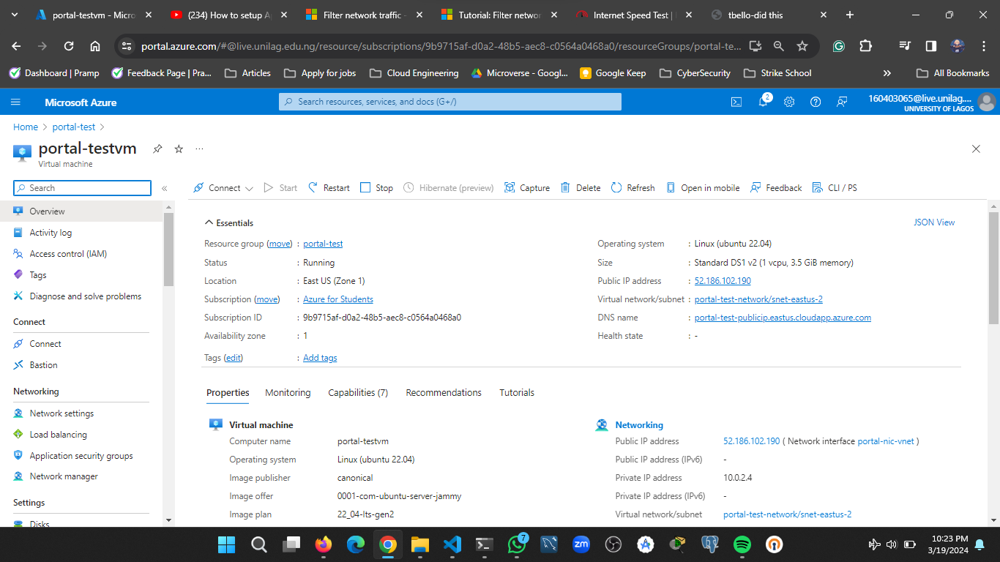
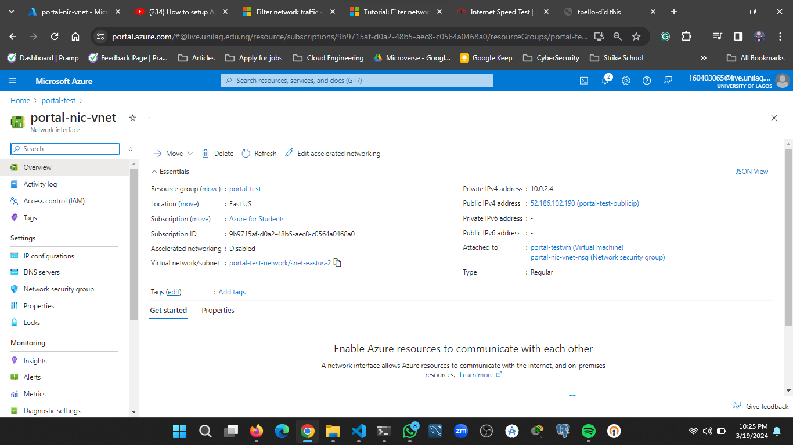
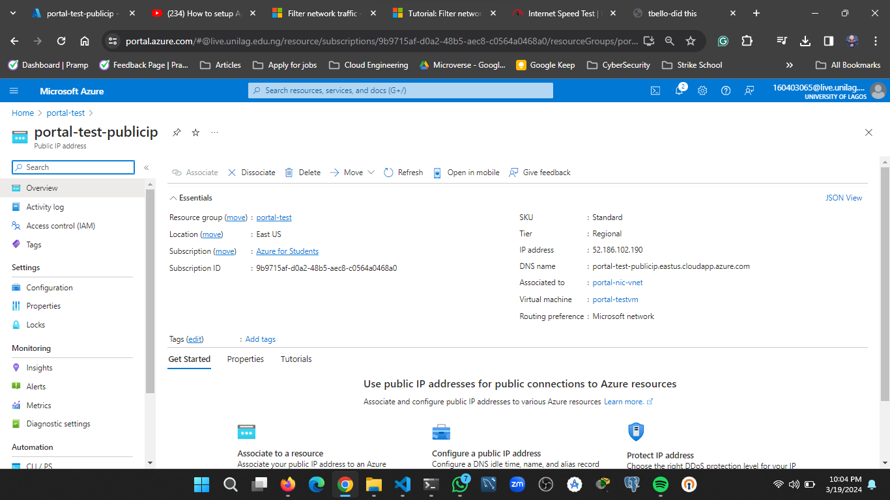

The codebase contains
- An azure template manager for deploying a Virtual Network, Public Ip address, network Security Group, Network Interface abd a Virtual Machine.
- Auto generated template manager from Azure portal

# Walkthrough
- Create a resource group: Created a resource group in east us region

- Create the virtual network in the newly created resource group

- Create a virtual machine in the newly created virtual network

- Create a network inteface card and attach to virtual machine. Ensure to specify the nic is assoicated with the virtual network

- Create a public ip address and attach it to the network interface card. Configure the public ip address with azure dns

- SSH into the virtual machine which has a linux OS, deployed an apache  server on it 
- View on browsers
[Live Link](http://portal-test-publicip.eastus.cloudapp.azure.com/)